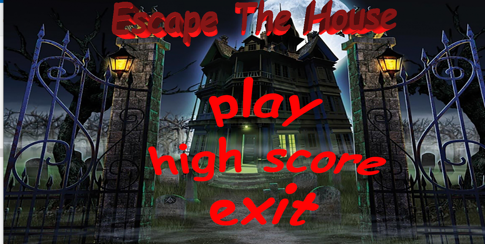
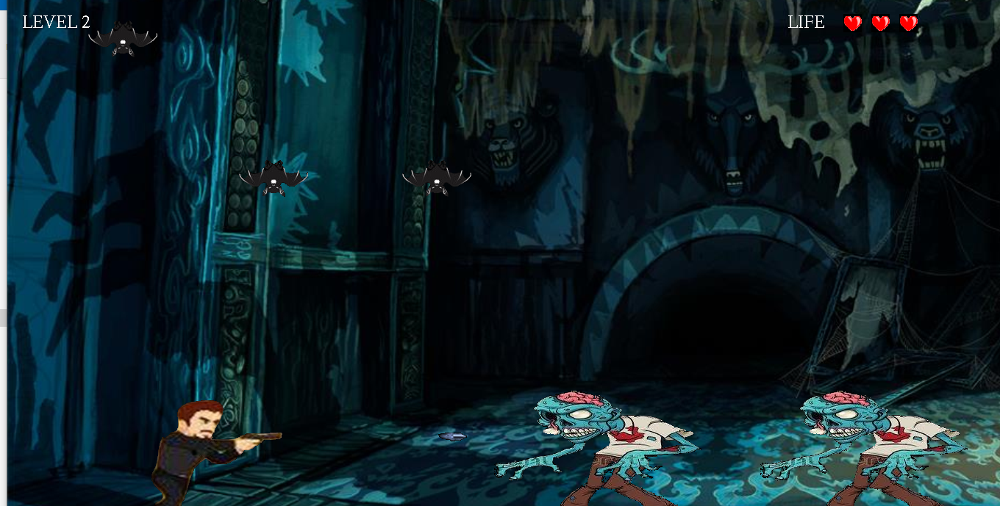
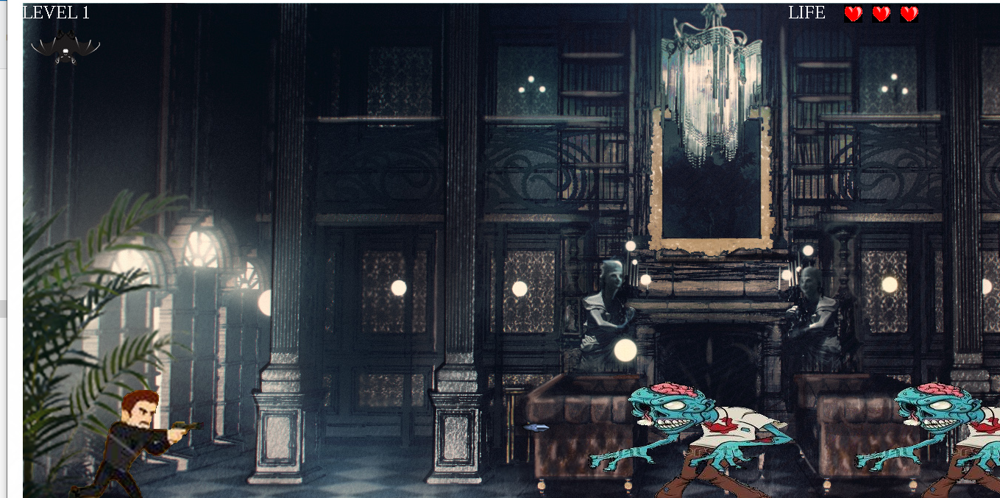
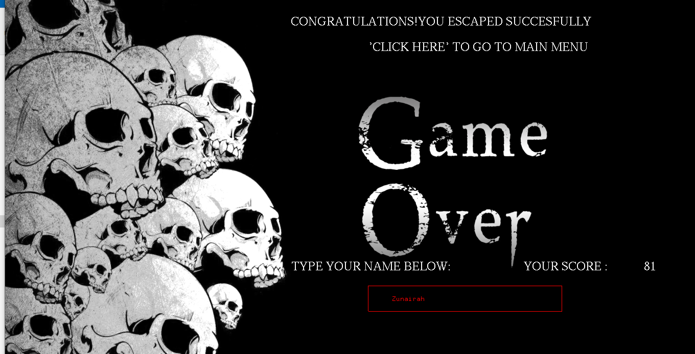
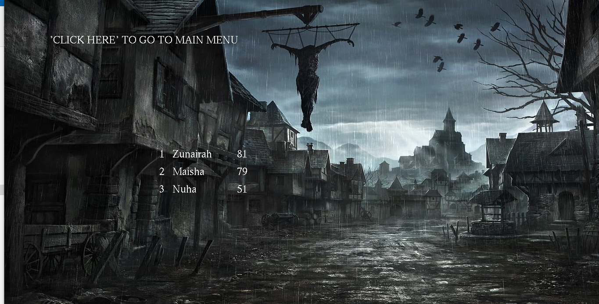

# Escape-the-house

## Table of contents

* [Introduction](#introduction)

* [Features](#features)

* [Technologies](#technologies)

* [Demo Screenshots](#demo-screenshots)

* [Setup](#setup)

## Introduction

This is a game built using 'iGraphics' where the player is trapped in a haunted house and to escape the house, he has to kill all the scary creatures present in the house. This was a group project built for an undergraduate academic course.

## Features

 * The player is given a gun and can shoot with it to kill the zombies
 
 * The player can move left and right to dodge the falling bats from above 
  
 * For every kill, the player is awarded points
  
 * The player has three lives to play with
  
 * The player loses a life and some points coming in contact with either the bats or zombies
  
 * There are three different levels of the game and the game gets more difficult with each level
  
 * The players can check if they are in the top three highest scorers

  ## Technologies
  * C++
  * C
  * OpenGL
  
  ## Demo Screenshots
  

 
 <h1>      </h1>

 

 

 
 
 <h1>      </h1>
 

 

 

 
 
 
 <h1>      </h1>

 

 

 
 
<h1>      </h1>
 

 

 
 
 
 
<h1>      </h1>
 

 

 ## Setup
XAMPP server should be set up locally. Then using 'phpMyAdmin' a database named 'projectf' should be created from there the 'project.sql' file should be imported. The whole project folder should be copied to the 'htdocs' folder of the XAMPP installation directory. After that in the web browser 'http://localhost/Football Buzz/filename.php' should be typed to access any page according to the file name.

